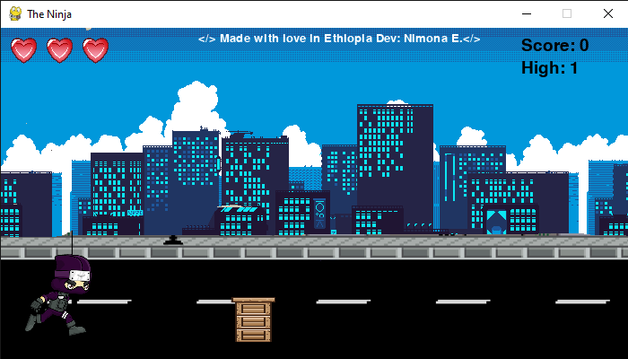
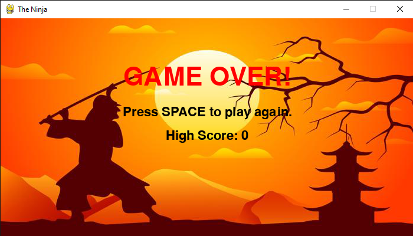

# The Ninja - Runner Game

A simple endless runner game built with Python and Pygame.

## Features

- Endless running gameplay with increasing speed
- Double jump mechanic
- Animated player and obstacles
- Parallax scrolling backgrounds
- Health system with heart icons
- Sound effects and background music
- High score saving
- Game Over and restart functionality

## How to Play

- Press `SPACE` to jump (double jump is allowed)
- Avoid obstacles to keep running
- The game gets faster as your score increases
- When you lose all hearts, press `SPACE` to restart

## Requirements

- Python 3.x
- [Pygame](https://www.pygame.org/) library

## Installation

1. Clone or download this repository.
2. Install Pygame if you haven't already:
    ```sh
    pip install pygame
    ```
3. Make sure the directory structure is as follows:
    ```
    main.py
    score.json
    images/
        bg/
        city/
        heart/
        obstacle/
        player/
    sound/
    ```
## Screenshots
Game screenshot


Game over screenshot


## Running the Game

Run the following command in your terminal:

```sh
python main.py
```

**Feel free to use and modify the code.**


**Developer**: Nimona Engida.

